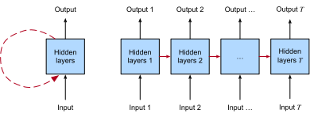

# Recurrent Neural Networks
:label:`chap_rnn`

Up until now, we have focused primarily on fixed-length data.
When introducing linear and logistic regression
in :numref:`chap_regression` and :numref:`chap_classification`
and multilayer perceptrons in :numref:`chap_perceptrons`,
we were happy to assume that each feature vector $\mathbf{x}_i$
consisted of a fixed number of components $x_1, \dots, x_d$,
where each numerical feature $x_j$
corresponded to a particular attribute.
These datasets are sometimes called *tabular*,
because they can be arranged in tables,
where each example $i$ gets its own row,
and each attribute gets its own column.
Crucially, with tabular data, we seldom
assume any particular structure over the columns.

Subsequently, in :numref:`chap_cnn`,
we moved on to image data, where inputs consist
of the raw pixel values at each coordinate in an image.
Image data hardly fit the bill
of a protypical tabular dataset.
There, we needed to call upon convolutional neural networks (CNNs)
to handle the hierarchical structure and invariances.
However, our data were still of fixed length.
Every Fashion-MNIST image is represented
as a $28 \times 28$ grid of pixel values.
Moreover, our goal was to develop a model
that looked at just one image and then
output a single prediction.
But what should we do when faced with a
sequence of images, as in a video,
or when tasked with producing
a sequentially structured prediction,
as in the case of image captioning?

Countless learning tasks require dealing with sequential data.
Image captioning, speech synthesis, and music generation
all require that models produce outputs consisting of sequences.
In other domains, such as time series prediction,
video analysis, and musical information retrieval,
a model must learn from inputs that are sequences.
These demands often arise simultaneously:
tasks such as translating passages of text
from one natural language to another,
engaging in dialogue, or controlling a robot,
demand that models both ingest and output
sequentially-structured data.


Recurrent neural networks (RNNs) are deep learning models
that capture the dynamics of sequences via
*recurrent* connections, which can be thought of
as cycles in the network of nodes.
This might seem counterintuitive at first.
After all, it is the feedforward nature of neural networks
that makes the order of computation unambiguous.
However, recurrent edges are defined in a precise way
that ensures that no such ambiguity can arise.
Recurrent neural networks are *unrolled* across sequence steps,
with the *same* underlying parameters applied at each step.
While the standard connections are applied *synchronously*
to propagate each layer's activations
to the subsequent layer *at the same time step*,
the recurrent connections are *dynamic*,
passing information across adjacent time steps.
As the unfolded view in :numref:`fig_unfolded-rnn` reveals,
RNNs can be thought of as feedforward neural networks
where each layer's parameters (both conventional and recurrent)
are shared across time steps.



:label:`fig_unfolded-rnn`


Like neural networks more broadly,
RNNs have a long discipline-spanning history,
originating as models of the brain popularized
by cognitive scientists and subsequently adopted
as practical modeling tools employed
by the machine learning community.
As with deep learning more broadly,
this book adopts the machine learning perspective,
focusing on RNNs as practical tools which rose
to popularity in the 2010s owing to
breakthrough results on such diverse tasks
as handwriting recognition :cite:`graves2008novel`,
machine translation :cite:`Sutskever.Vinyals.Le.2014`,
and recognizing medical diagnoses :cite:`Lipton.Kale.2016`.
We point the reader interested in more
background material to a publicly available
comprehensive review :cite:`Lipton.Berkowitz.Elkan.2015`.
We also note that sequentiality is not unique to RNNs.
For example, the CNNs that we already introduced
can be adapted to handle data of varying length,
e.g., images of varying resolution.
Moreover, RNNs have recently ceded considerable
market share to transformer models,
which will be covered in :numref:`chap_attention-and-transformers`.
However, RNNs rose to prominence as the default models
for handling complex sequential structure in deep learning,
and remain staple models for sequential modeling to this day.
The stories of RNNs and of sequence modeling
are inextricably linked, and this is as much
a chapter about the ABCs of sequence modeling problems
as it is a chapter about RNNs.


One key insight paved the way for a revolution in sequence modeling.
While the inputs and targets for many fundamental tasks in machine learning
cannot easily be represented as fixed length vectors,
they can often nevertheless be represented as
varying-length sequences of fixed length vectors.
For example, documents can be represented as sequences of words.
Medical records can often be represented as sequences of events
(encounters, medications, procedures, lab tests, diagnoses).
Videos can be represented as varying-length sequences of still images.


While sequence models have popped up in countless application areas,
basic research in the area has been driven predominantly
by advances on core tasks in natural language processing (NLP).
Thus, throughout this chapter, we will focus
our exposition and examples on text data.
If you get the hang of these examples,
then applying these models to other data modalities
should be relatively straightforward.
In the next few sections, we introduce basic
notation for sequences and some evaluation measures
for assessing the quality of sequentially structured model outputs.
Next, we discuss basic concepts of a language model
and use this discussion to motivate our first RNN models.
Finally, we describe the method for calculating gradients
when backpropagating through RNNs and explore some challenges
that are often encountered when training such networks,
motivating the modern RNN architectures that will follow
in :numref:`chap_modern_rnn`.

```toc
:maxdepth: 2

sequence
text-sequence
language-model
rnn
rnn-scratch
rnn-concise
bptt
```

